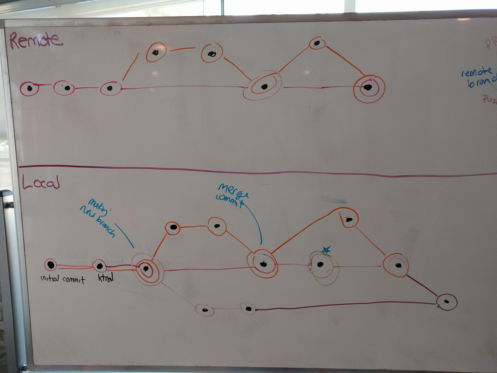

[Table of Contents](/README.md)
This code is a test

# Day 07 - Grid systems, Sass libraries, Git Partner Flow

## Review
- sass map
  - links your html to the scss file so that you can find errors more easily
- .gitignore file, .surgeignore file
  - gitignore.io
  - ignore files in git repo or surge project
  - those files are not included when syncing with remote versions
- mixins
  - createing a mixin
```scss
@mixin mixinName($localVariableName) {
  color: $localVariableName;
  border-radius: anotherValue;
}
```
  - using a mixin
```scss
@include mixinName(value);
```
- nesting
  - keep nesting less than 4 levels deep
  - the 4th level is usually reserved for state such as `&:hover` or the like

## Challenge

## Notes
### DRY (use classes to not repeat code)
  - don't repeat yo'self
  - use classes for repeat styles
  - sass variables for repeating values
  - mixins for repeating rulesets
  - after you've written the same code 3 times, it's time to **abstract** that code into a variable, mixin, etc

### CSS transitions
  - transitions make changes to elements style over time
  - any property that has gradient values can be transitioned
  - use shorthand `transition` property:
    - `transition: background 2s, color .5s;`
  - include `transition` property to ruleset of element that should transition.
    - often used with states like hover. the target style should reside in the hover ruleset
  - css animations are a thing, feel free to look them up with all your extra time

### mixin libraries / grid frameworks
  - bourbon
    - installation
      - one time only : `sudo gem install bourbon`
      - `bourbon install` in the project's sass directory
    - use
      - `@import 'path/to/bourbon/partial';`
      - sass watch the sass directory
      - profit
    - pixel to rem/ems
    - border color
    - ellipsis
  - neat
    - grid framework - a layout tool that defines our website in terms of vertical columns and how many columns an element takes up
    - installation
      - one time only : `sudo gem install neat`
      - `neat install` in the project's sass directory
    - use
      - `@import 'path/to/neat/partial';` **after** bourbon import (neat depends on bourbon)
      - include neat mixins in your sass files
        - `@include outer-container(1000px)` sets up an area of the page to be a grid and sets the max width of that grid
        - `@include span-columns(4)` sets an element to be 4 (or other number) of columns wide
        - `@include omega()` removes margin right from the last element in a grid layout so it fits in the row

### github branches

  - branches represent a series of commits, a particular path through history
  - `git checkout -b <branch name>` (-b makes NEW branch)
  - `git checkout <branch name>` (existing move to an existing branch)
  - merge commits are special commits that marry two branches together. The branches can diverge again in the future.


### github group project flow

  - one person in the group makes the repo and puts it on github
  - give your partners collaborator status on github
  - partners should clone the remote into a new project folder to start the project `git clone <remote git address> <path/to/the/project/folder>.`
  - for each feature: work locally **on a feature branch**, commit after successful changes
  - push local branch to the remote branch `git push origin <branch name>`
  - make a pull request to merge the remote branch into the remote master on github
  - get your teammates to approve the code
  - after the pull request is merged, everyone pulls origin master
    - the writer of the newly merged code runs `git checkout master` and then `git pull origin master`, fix any merge conflicts, and add and commit the result.
    - the other team members stay on their feature branches and run `git pull origin `, fix any merge conflicts, and add and commit the result.
    

## Resources
- [Bourbon Docs](http://bourbon.io/docs/)
- [Neat Docs](http://neat.bourbon.io/examples/)
