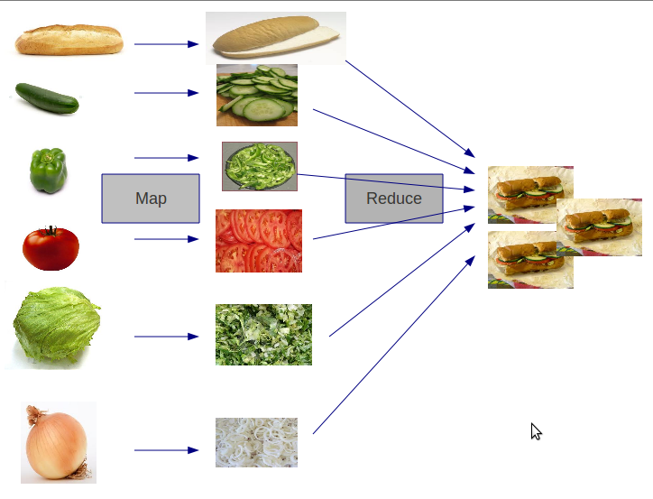

[Table of Contents](/README.md)

# Day 13 - forEach, filter, map, reduce, jquery

## Review
- cdn, css reset
  - cloud server network
  - css reset equalizes starting point across browsers
- add class
  - `element.classList.add('className')`
  - where element is an HTML element that was accessed from the DOM
  - where className is the name of the class you want to add to the element
  - this only works on an individual element, not a list of elements
- formatting stuff we put into the DOM

## Challenge
Write a function called sum that will return the sum of ANY NUMBER of arguments. eg:
```js
sum(1, 2, 5) // evaluates to 8
sum(4, 2) // evaluates to 6
sum(9, 34, 25, 1, -3) //evaluates to 66
```
HINT: you will need the special `arguments` keyword

## Notes
- finish the array method examples
  - if you need to filter and map to get your answer, make sure you filter first! or you won't have access to the full item
  - the sandwich analogy:
    - we can first filter all the ingredients in the house to be just the ingredients needed for a sandwhich
    - map over them to get sliced ingredients
    - reduce them into sandwiches
    - forEach to eat them (no return value, just does something)
  
- jquery
  - used for:
    - DOM manipulation
    - Event handling
  - include in project
    - include in a script tag pointing to the jquery cdn
  - select elements
    - `$('cssSelector')`
      - where `cssSelector` is any valid css selector
      - will return a set of jQuery wrapped elements - all that match the selector
  - get vs set
    - `jQueryWrappedElements.text()`, `jQueryWrappedElements.html()`
      - where `jQueryWrappedElements` is any set of elements selected with the jQuery selector (see above)
      - used with no arguments, these functions return the `textContent` or `innerHTML` of the first element in the `jQueryWrappedElements` set.
      - used with any string argument, these functions will replace `textContent` or `innerHTML` of ALL the elements in the set.
      - with `.html('htmlString')` the `htmlString` will be parsed as HTML and element tags will be turned into elements
      - with `.text('string')` the `string` will NOT be parsed as HTML, and element tags will be placed into the DOM exactly as they appear in the string
  - create an element
    - `$('actualHTMl')`
      - where `actualHTML` is a string of html to create
      - this element is created, but not stored OR put into the DOM
      - to store it, put it in a variable.
      - to put it in the DOM, use the `.html()` method above, or the `.append()` or `.prepend()` methods below:
  - `.append(elementOrString)`, `.prepend(elementOrString)`
    - where `elementOrString` is an HTML element, a jQuery wrapped element or set of elements, or a plain text string
    - `elementOrString` will be parsed as HTML and added to the element on which the method is performed.
    - `.prepend(elementOrString)` will add `elementOrString` as the **first** child of the element it is performed on
    - `.append(elementOrString)` will add `elementOrString` as the **last** child of the element it is performed on
  - `.addClass(className)`, `.removeClass(className)`
    - where `className` is a string of the class to add or remove
    - will add or remove the class from ALL elements in the jQuery set of elements at once.
  - `.on()`
    - the jQuery way of adding event listeners, nearly identical to `.addEventListener()`
    - will apply to all elements in the jQuery set of elements, rather than only on one at a time
  - `.toggleClass(className)`
    - as the name implies, will toggle a class, so just like add or remove class, but if the class is there, it removes it, if the class is not there it will add it.

## Resources
- [jQuery docs](http://jquery.com/)
